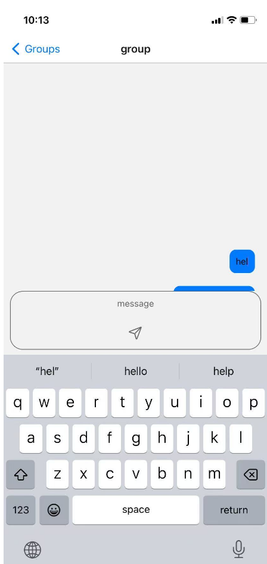

# Exercise 2

## 1. Environment

| tool | version |
| ---- | ------- |
| node | 22.15.1 |

## 2. Project structure

Project structure(source codes are all .jsx files under the app directory and include the initialized group.json under the data folder)


dependencies(package.json):

```json
{
    "dependencies": {
    "@expo/vector-icons": "^14.1.0",
    "@legendapp/list": "^1.0.14",
    "@react-navigation/elements": "^2.4.2",
    "@react-navigation/native": "^7.1.9",
    "expo": "~53.0.9",
    "expo-constants": "~17.1.6",
    "expo-linking": "~7.1.5",
    "expo-router": "~5.0.7",
    "expo-status-bar": "~2.2.3",
    "expo-symbols": "~0.4.4",
    "react": "19.0.0",
    "react-native": "0.79.2",
    "react-native-safe-area-context": "5.4.0",
    "react-native-screens": "~4.10.0"
  },
  "devDependencies": {
    "@babel/core": "^7.20.0"
  },
}
```

Text Editor: VS code

platform: Web, Android, IOS


## 3. Features(demo)

### 1. Create groups

You can create group using the "+" button in home page:


### 2. Load & add message

1. After clicking into one of the group, we can see messages under that group loaded from `group.json` under the `/data` directory.  We can also add message under this group.

   

2. You can see the message added to this group after sending the message:

   

3. Clicking the Groups button on the left top corner will navigate you back to the Group page and re-enter this page. You will still be able to see the newly added message because of the context store used in this app, which maintain the global state while the app is on.


### 3. Edit message

1. Long press one message box will enable you to edit the message. You can add or delete characters beside the cursor.

   

   2. Then tap anywhere outside the message box to make the message box blur and edit the message:

      

   3. Click the Groups to back to the home page and re-enter this group page will still allow you to see the edited message


### 4. Delete message

1. To delete a message, just long press one message box and delete all characters inside this message box

   

2. Tap anywhere outside that message box to make it blur. The message is automatically deleted.

   

3. Click the Groups button to back to the home page and re-enter this group page. You will still be able to find the messages deleted.

## 4.How to run

Demo on IOS device

1. Install the node https://nodejs.org/en/download

2. Go to the root folder of Exercise 2 and Install all dependencies using the following commands:

   ```bash
   npm install
   npx expo install
   ```

3. Install Expo Go from app market in your iphone

4. run `npx expo start` inside the project and there will be a QR code like the following:

   

5. Scan the QR code using the camera will lead you to Expo Go and You will be able to see the app page inside

## 5. Github link

https://github.com/junior-stack/COMP5450-E2
